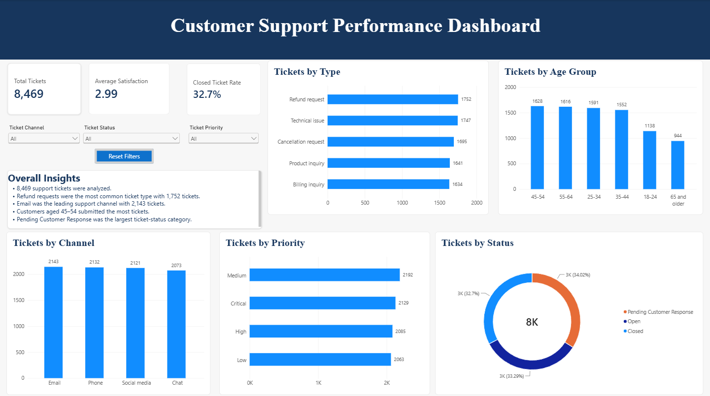

# Customer Support Performance Dashboard

## Project Overview

This Power BI project analyzes 8,469 customer support tickets to identify patterns in ticket volume, customer satisfaction, support channels, priorities, ticket types, customer age groups, and resolution status.

The dashboard allows users to filter results by ticket channel, ticket status, and priority. A Reset Filters button returns the report to its original view.

## Tools and Skills

* Power BI Desktop
* Power Query
* DAX measures
* Data cleaning and transformation
* KPI development
* Interactive slicers
* Data visualization
* Dashboard design
* Business insight reporting

## Dashboard KPIs

* **Total Tickets:** 8,469
* **Average Customer Satisfaction:** 2.99
* **Closed Ticket Rate:** 32.7%

## Key Findings

* Refund requests were the most common ticket type, with 1,752 tickets.
* Email was the leading support channel, with 2,143 tickets.
* Customers aged 45–54 submitted the most support tickets.
* Medium-priority tickets represented the largest priority category.
* Pending Customer Response was the largest ticket-status category.

## Dashboard Features

* KPI cards for ticket volume, satisfaction, and closure rate
* Ticket analysis by type, channel, priority, status, and customer age group
* Interactive dropdown slicers
* Reset Filters button
* Data labels and business insights
* Consistent, portfolio-ready visual design

## Data Source

The project uses the [Customer Support Ticket Dataset on Kaggle](https://www.kaggle.com/datasets/suraj520/customer-support-ticket-dataset).

## Repository Files

* `Customer Support Performance Dashboard.pbix` — Interactive Power BI report
* `dashboard-preview.png` — Dashboard preview image
* `README.md` — Project documentation

## Author

**Shuawna Kang**
Data Analytics graduate skilled in Power BI, SQL, Excel, Python, data visualization, and business analysis.
